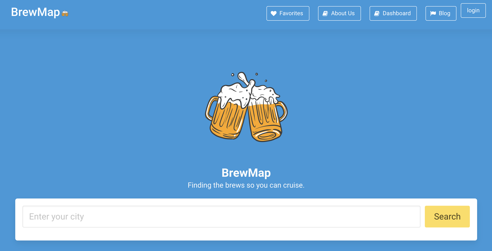
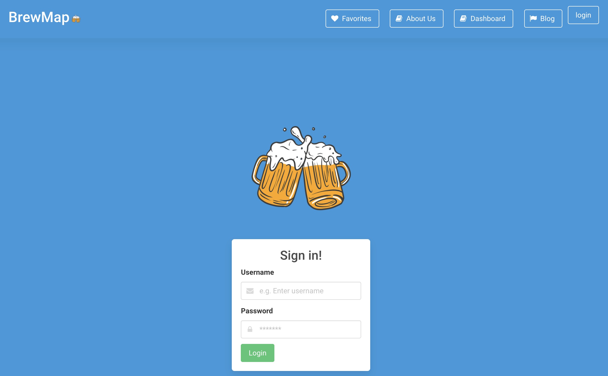
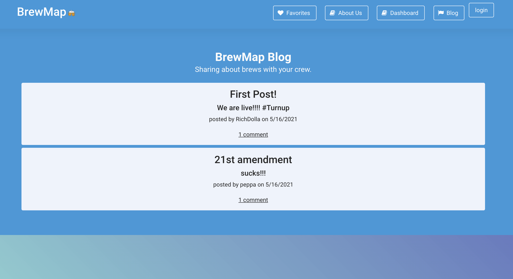

# BrewMap
## Decription
### Our Vision
The pandemic is finally over, your friends are all vaccinated and it’s time to grab some drinks at your local pubs. Just one brewery isn’t going to cut it - you want to do a full pubcrawl to celebrate the momentous occasion. What is close by? Where should we go first, second, third?

BrewMap is here to help! 

### Front-End Development
The BrewMap project uses two server-side APIs to allow the user to locate breweries in a given city. The user is given an option to view the brewery website and/or add the brewery to favorites. The favorites tab uses client-side storage to list breweries added, persisting upon refresh. Users can clear their favorites at any time. 

### Back-End Development
The new, improved and Heroku deployed BrewMap webpage includes a user login that encrypts user passwords for privacy. Once logged in, the user can access their Dashboard, allowing them to post and comment on the BrewMap community blog. 

## Technologies Used
* HTML
* CSS 
* Bulma CSS Framework[(Bulma)](https://github.com/BulmaTemplates/bulma-templates/blob/master/templates/landing.html)
* MDBootstrap
* JavaScript
* Client-side local storage
* Server-side APIs (Open Brewery and Bing Maps)
* Modals
* Node.js
* Express.js
* RESTful API
* Handlebars.js
* MySQL and Sequelize ORM
* Heroku

## Screenshots

## Launch
Try out our application here: [BrewMap2.0](https://salty-thicket-97397.herokuapp.com/)

## About Us
* [Tela Caul](https://telacaul.github.io/caul-professional-portfolio/)
* [Felicia Harris-Foster](https://harrisfd.github.io/portfolio-page/)
* [Rich Brian Santos](https://rbsantos-code.github.io/all-about-me/)
* [Ian Osborne](https://riosborne6.github.io/Portfolio/)